# Analise de Casos de COVID-19 (DATASUS) 2025

Analise descritiva e diagnostica sobre o dataset de casos de COVID-19 no Brasil, disponibilizado pelo DATASUS (SIVEP-Gripe), com ~318 mil registros de 2025.

## Objetivo

Identificar padroes criticos sobre o total de casos de COVID-19 no Brasil, por estado, faixa etaria, comorbidades, taxa de internacao na UTI e taxa de vacinacao.

## Questoes respondidas

- Quais comorbidades foram mais frequentes?
- Quais sintomas foram mais frequentes?
- Quantos casos vacinados em relacao ao total?
- Quais comorbidades e sintomas sao mais frequentes por sexo?
- Quantos casos de internacao em UTI em relacao ao total?
- Qual a taxa de gravidade (UTI) entre vacinados e nao vacinados?
- Em quantos casos fizeram raio-X e tomografia em relacao ao total?

## Estrutura do repositorio

```
COVID19-2025/
├── data/                          # Dataset para analise
│   └── data_set_analisado.csv
├── scripts/                       # Codigos R e SQL
│   ├── 01_etl.R                   # Extracao e transformacao dos dados
│   ├── 02_analise.R               # Script principal de analise
│   └── etl_sql_referencia.sql     # Queries SQL de referencia
├── resultados/                    # Resultados e relatorios
│   ├── analise_descritiva.Rmd     # Relatorio reprodutivel (R Markdown)
│   └── graficos/                  # Graficos gerados
├── docs/                          # Documentacao
│   ├── fonte_dos_dados.md         # Fonte e processo de ETL
│   └── conclusao.md               # Conclusoes da analise
├── README.md
└── LICENSE
```

## Tecnologias

- **R** (tidyverse, ggplot2, skimr, janitor)
- **SQL** (SQLite)
- **Excel / Power Query** (recodificacao de variaveis)

## Dados

- **Fonte:** [DATASUS - SRAG 2021-2022](https://dados.gov.br/dados/conjuntos-dados/srag-2021-e-2022)
- **Dataset bruto:** INFLUD25-15-12-2025.csv (~398 mil linhas)
- **Dataset final:** 318.735 linhas x 35 colunas (apos ETL)
- **Detalhes do ETL:** [docs/fonte_dos_dados.md](docs/fonte_dos_dados.md)
- [Datasets do projeto no Google Drive](https://drive.google.com/drive/u/2/folders/19_gSEzlOwNPJJ_BaG6RUaiWtrmzmPxMO)

## Como reproduzir

1. Clone o repositorio
2. Instale os pacotes R necessarios:
   ```r
   install.packages(c("tidyverse", "skimr", "janitor"))
   ```
3. Execute os scripts na ordem:
   - `scripts/01_etl.R` — ETL (requer o dataset bruto do DATASUS)
   - `scripts/02_analise.R` — Analises e geracao de graficos
4. Ou abra `resultados/analise_descritiva.Rmd` no RStudio e clique em **Knit** para gerar o relatorio HTML

## Principais resultados

### Distribuicao por sexo
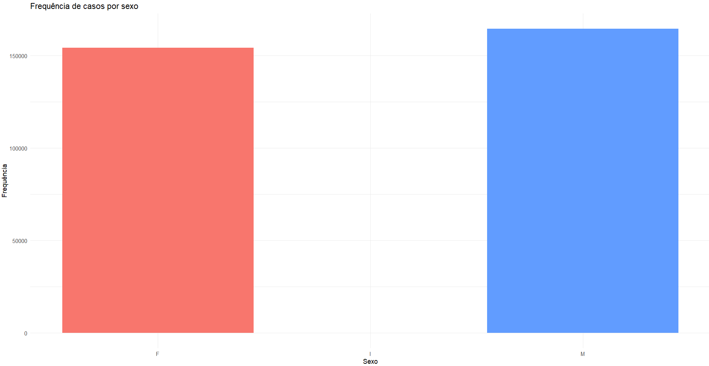

### Comorbidades mais frequentes
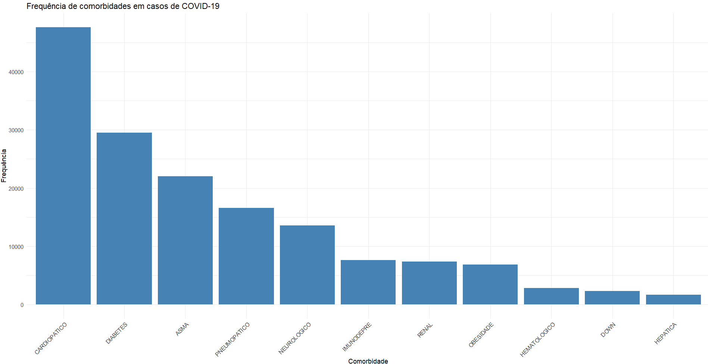

### Top 5 comorbidades por sexo
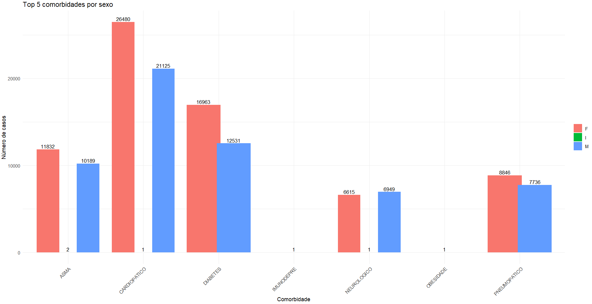

### Sintomas mais frequentes
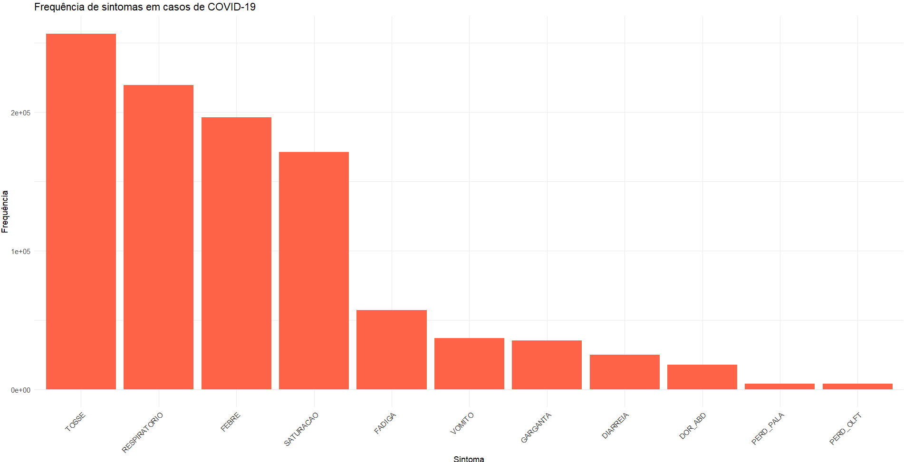

### Top 5 sintomas por sexo
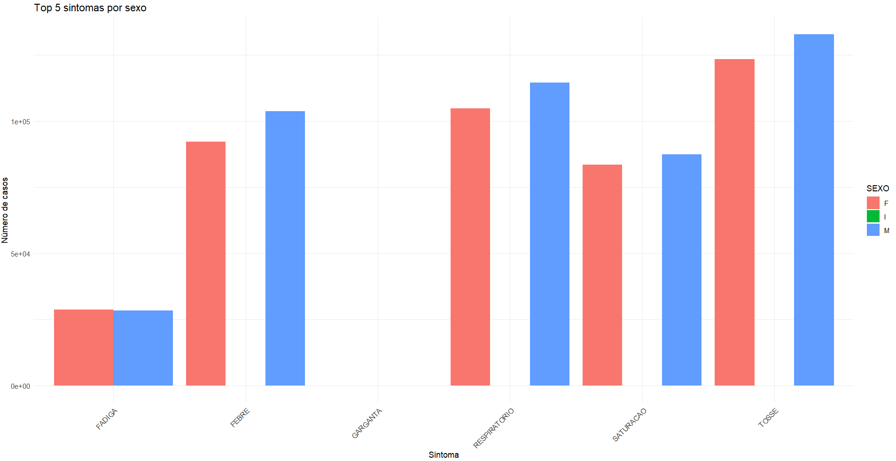

### Status vacinal
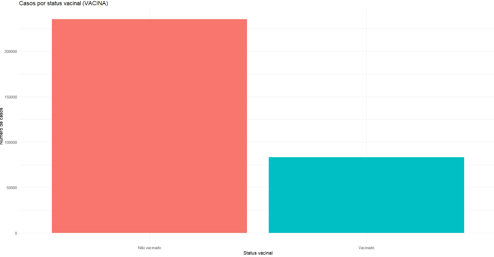

### Total de casos por faixa etaria
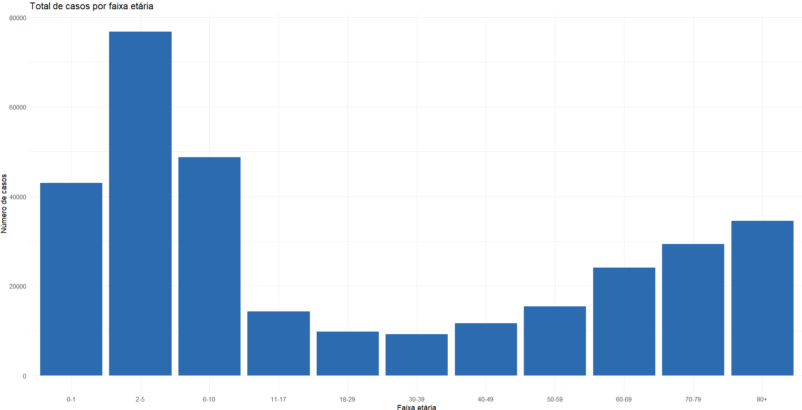

### Casos por faixa etaria e status vacinal
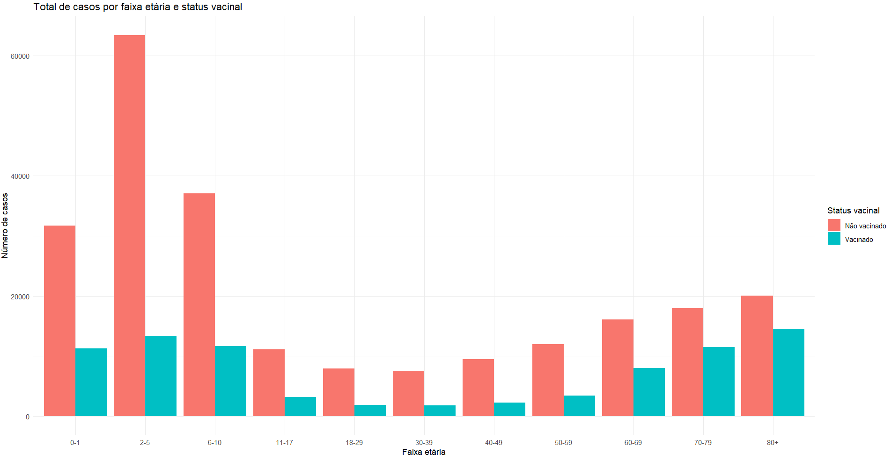

### Taxa de UTI por status vacinal
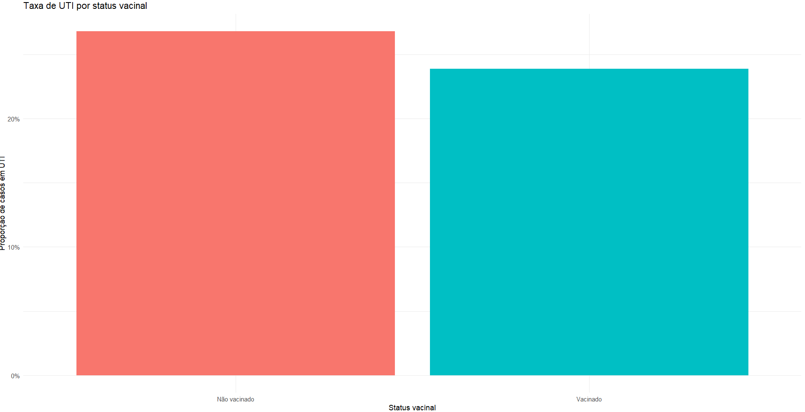

### Internacao em UTI por faixa etaria
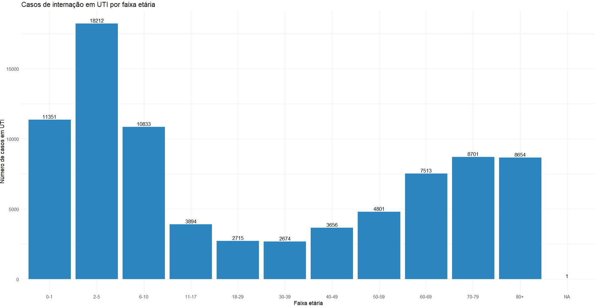

### Percentual de internacoes em UTI por faixa etaria
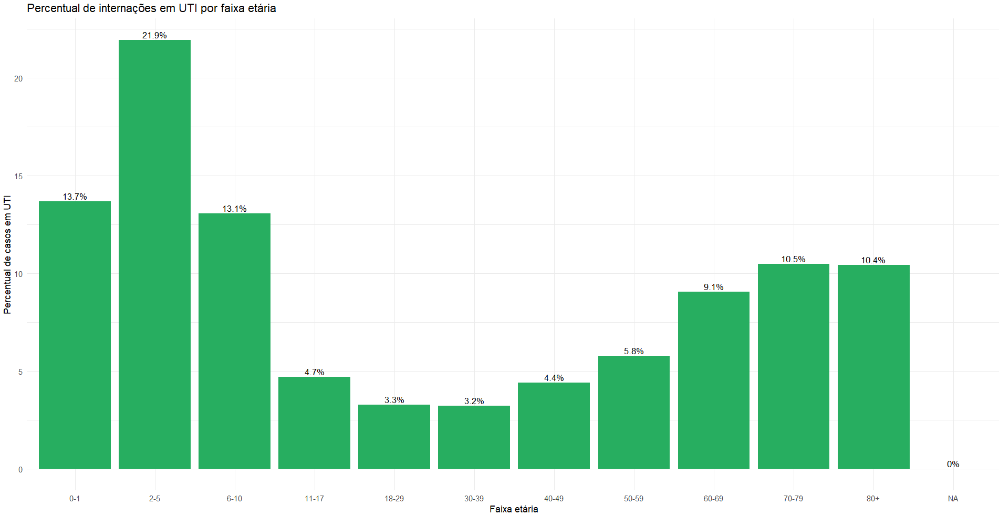

### UTI nao vacinados por faixa etaria
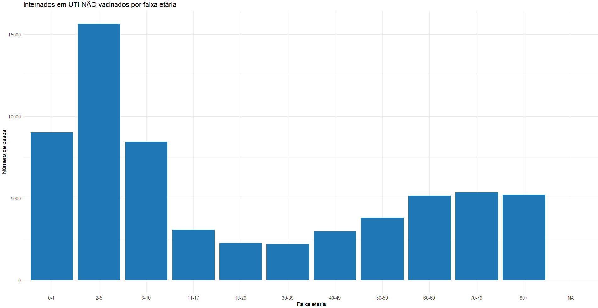

### UTI vacinados por faixa etaria
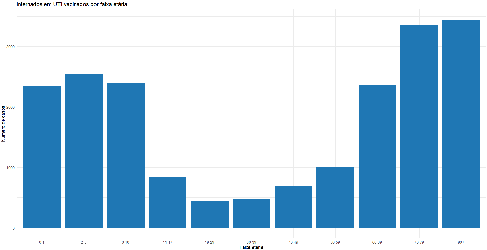

### Exames de imagem
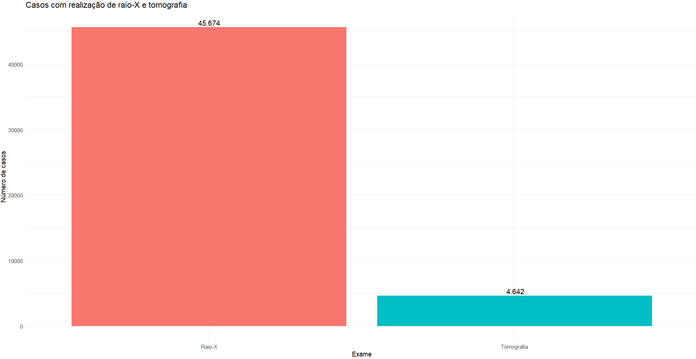

### Percentual por situacao de exame
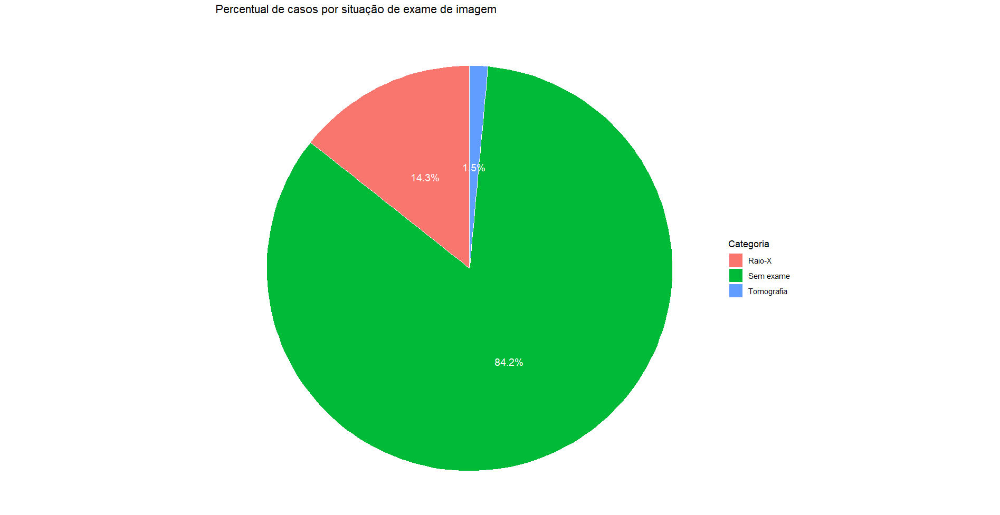

## Conclusao

Leia a conclusao completa em [docs/conclusao.md](docs/conclusao.md).

## Instrucoes de uso

*Este projeto tem objetivos academicos, exclusivamente.*

**Permitido:** Observar o trabalho e usar como referencia para replicar o metodo.

**Proibido:** Utilizar as analises e conclusoes para fazer declaracoes, citacoes e afirmacoes de qualquer natureza.

## Licenca

Este projeto esta licenciado sob a [MIT License](LICENSE) - Copyright (c) 2026 Michele Oliveira.
